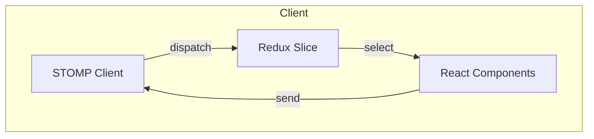

> This post is adapted from my [original article on Medium](https://medium.com/@syedyawar2/integrating-stomp-js-in-a-react-js-application-using-redux-toolkit-53e1242b396e).

## Why STOMP Over Raw WebSockets

WebSockets give you a persistent, bidirectional connection between client and server. But raw WebSocket connections leave you handling message routing, subscriptions, and reconnection logic yourself. STOMP (Simple Text Oriented Messaging Protocol) adds a thin messaging layer on top of WebSockets (destinations, subscriptions, headers) that makes real-time communication structured and predictable.

If your backend uses Spring Boot (which ships with STOMP support via Spring WebSocket), STOMP.js on the frontend is the natural pairing.

## The Architecture

The integration has three layers:



1. **STOMP Client** manages the WebSocket connection lifecycle (connect, disconnect, reconnect)
2. **Redux Toolkit Slice** holds real-time state (messages, connection status) in the global store
3. **React Components** subscribe to Redux state and dispatch actions to send messages

The key design decision is keeping the STOMP client outside of React's component tree. WebSocket connections are long-lived and shouldn't be tied to component mount/unmount cycles.

## Setting Up the STOMP Client

The STOMP client should be initialized once and managed as a singleton. Using `@stomp/stompjs`, the setup looks like this:

```typescript
import { Client } from '@stomp/stompjs';

const stompClient = new Client({
  brokerURL: 'ws://localhost:8080/ws',
  reconnectDelay: 5000,
  heartbeatIncoming: 4000,
  heartbeatOutgoing: 4000,
});
```

The `reconnectDelay` and heartbeat settings are important for production use. They keep the connection alive and handle network interruptions without manual retry logic.

## Redux Toolkit Slice for Real-Time State

Rather than scattering WebSocket state across components with `useState`, centralizing it in Redux makes the data flow predictable. A minimal slice looks like:

```typescript
import { createSlice, PayloadAction } from '@reduxjs/toolkit';

interface WebSocketState {
  connected: boolean;
  messages: Message[];
}

const initialState: WebSocketState = {
  connected: false,
  messages: [],
};

const webSocketSlice = createSlice({
  name: 'webSocket',
  initialState,
  reducers: {
    setConnected(state, action: PayloadAction<boolean>) {
      state.connected = action.payload;
    },
    addMessage(state, action: PayloadAction<Message>) {
      state.messages.push(action.payload);
    },
    clearMessages(state) {
      state.messages = [];
    },
  },
});
```

When the STOMP client receives a message, it dispatches `addMessage` to the store. Components that need real-time data simply select from the store. No prop drilling, no context juggling.

## Connecting the Client to the Store

The bridge between STOMP and Redux happens in the client's callback handlers:

```typescript
import { store } from './store';
import { setConnected, addMessage } from './webSocketSlice';

stompClient.onConnect = () => {
  store.dispatch(setConnected(true));

  stompClient.subscribe('/topic/messages', (message) => {
    const parsed = JSON.parse(message.body);
    store.dispatch(addMessage(parsed));
  });
};

stompClient.onDisconnect = () => {
  store.dispatch(setConnected(false));
};
```

This pattern keeps the STOMP logic decoupled from React. The store acts as a buffer. STOMP pushes data in, React reads data out.

## Activating on App Mount

The client should be activated when the application mounts and deactivated on teardown. A top-level effect handles this:

```typescript
useEffect(() => {
  stompClient.activate();
  return () => {
    stompClient.deactivate();
  };
}, []);
```

Place this in your root layout or a dedicated provider component. The STOMP client handles reconnection internally, so you don't need to manage connection state in the effect.

## Sending Messages

Sending messages through the STOMP client is straightforward:

```typescript
function sendMessage(destination: string, body: object) {
  if (stompClient.connected) {
    stompClient.publish({
      destination,
      body: JSON.stringify(body),
    });
  }
}
```

Components call this function when the user triggers an action. The response comes back through the subscription and flows into Redux, maintaining unidirectional data flow even with bidirectional communication.

## Lessons from Production Use

### Connection Status in the UI

Users should know when the real-time connection drops. Selecting `connected` from the Redux store and showing a subtle indicator (a badge, a toast) prevents confusion when messages stop arriving.

### Message Ordering

STOMP preserves message order within a single subscription, but if you're subscribing to multiple topics, messages can interleave. If ordering matters across topics, add timestamps to your message payloads and sort on the client side.

### Cleanup Subscriptions

If your application has routes that subscribe to different topics, unsubscribe when the component unmounts. STOMP subscriptions return an object with an `unsubscribe` method. Call it in your cleanup function to avoid memory leaks and stale handlers.

### Don't Store Everything

Not every WebSocket message belongs in Redux. Ephemeral state like typing indicators or cursor positions can live in local component state. Reserve Redux for data that multiple components need or that should survive navigation.

## When This Pattern Fits

This architecture works well when:

- Your backend already speaks STOMP (Spring Boot, RabbitMQ with STOMP plugin)
- Multiple components need access to real-time data
- You want predictable state management for asynchronous, push-based data
- Connection lifecycle (reconnect, heartbeat) needs to handle failures well

For simpler cases (a single component listening to one stream), a direct WebSocket hook might be sufficient. The Redux layer adds value when real-time state is shared across the application.
