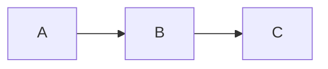

# Content Style Guide

Write like a human software engineer. Avoid patterns that read as AI-generated.

## Avoid

- **Emojis** in blog posts, about copy, or case studies
- **Em dashes (—)** as sentence connectors; use periods, colons, or parentheses instead
- **Double hyphens (--) or underscores (\_\_)** as visual separators
- **Formulaic openers** like "Here's the uncomfortable truth", "For completeness", "It's worth noting"
- **Overused adjectives**: robust, seamless, comprehensive, leverage, delve, dive into
- **Bullet lists** where every item is "**Bold label** — explanation"; vary structure
- **Dramatic phrasing** like "dramatically faster"; prefer "much faster" or "a lot faster"

## Prefer

- Short, direct sentences
- Colons for lists or explanations: "The fix was simple: we cached it."
- Parentheses for asides: "The happy path (AI suggests, user approves) was straightforward."
- Concrete examples over abstract claims
- First-person when sharing experience
- Plain language over jargon unless the audience expects it

## Mermaid Diagrams

Use Mermaid for flowcharts, sequence diagrams, and architecture sketches. In blog posts, use fenced code blocks:

````markdown

````

In case studies, add an optional `mermaid` field to `architecture` in `src/data/case-studies.ts`. Diagrams render client-side and respect light/dark theme.

## Tone

Sound like an engineer explaining something to a colleague. Confident but not salesy. Specific over generic.
